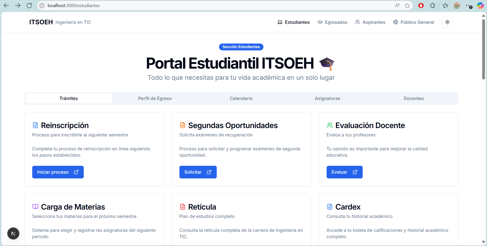

# 🎓 Portal Estudiantil ITSOEH - Ingeniería en Tecnologías de la Información y Comunicaciones.

> Plataforma digital moderna y responsiva para la carrera de Ingeniería en Tecnologías de la Información y Comunicaciones del Instituto Tecnológico Superior del Occidente del Estado de Hidalgo.

## ✨ Características Principales

Este portal estudiantil ha sido diseñado pensando en las necesidades específicas de los estudiantes universitarios de la carrera de Ingeniería en TICs, con un enfoque en la experiencia de usuario y la accesibilidad móvil.

### 🚀 Sección Estudiantes

- **Diseño Responsivo**: Optimizado para dispositivos móviles 
- **Modo Oscuro/Claro**: Cambia entre temas según tus preferencias
- **Interfaz Moderna**: Componentes UI elegantes y funcionales
- **Experiencia Intuitiva**: Navegación sencilla entre secciones

### 📋 Módulos Principales

- **Trámites Académicos**: Acceso rápido a procesos de reinscripción, segundas oportunidades, evaluación docente y más
- **Perfil de Egreso**: Visualización de los 12 objetivos educacionales de la carrera
- **Calendario Académico**: Calendario interactivo con fechas importantes y eventos
- **Asignaturas**: Buscador y filtros para encontrar información sobre materias
- **Directorio Docente**: Información de contacto y ubicación de profesores
- **Eventos Próximos**: Mantente al día con las actividades del instituto

## 🗂️ Estructura del Proyecto

```
itsoeh-tic/
├── app/                    # Rutas y páginas (App Router)
│   ├── estudiantes/        # Sección de estudiantes
│   ├── egresados/          # Sección de egresados (pendiente)
│   ├── aspirantes/         # Sección de aspirantes (pendiente)
│   ├── publico/            # Sección de público general (pendiente)
│   ├── layout.tsx          # Layout principal
│   ├── page.tsx            # Página de inicio
│   └── globals.css         # Estilos globales
├── components/             # Componentes reutilizables
│   ├── ui/                 # Componentes de UI básicos
│   ├── calendario-academico.tsx
│   ├── buscador-asignaturas.tsx
│   ├── directorio-docentes.tsx
│   ├── eventos-proximos.tsx
│   ├── navbar.tsx
│   ├── footer.tsx
│   └── mode-toggle.tsx
├── public/                 # Archivos estáticos
│   ├── images/             # Imágenes
│   └── documents/          # PDFs y documentos
└── ...
```

## 🚀 Instalación y Ejecución

Sigue estos pasos para instalar y ejecutar el proyecto localmente:

1. **Descarga el repositorio** o el archivo del proyecto.

2. **Instala las dependencias y ejecuta el proyecto**:

   * Usa el siguiente comando para instalar las dependencias:

     ```bash
     pnpm i
     ```

   * Luego, ejecuta el servidor de desarrollo:

     ```bash
     pnpm dev
     ```

   * Finalmente, abre tu navegador y accede a:

     ```
     http://localhost:3000
     ```


### Requisitos Previos

- Node.js 18.0 o superior
- npm o yarn

  ## ✨ ESTUDIANTES



  ## ✨ Link de Vercel
